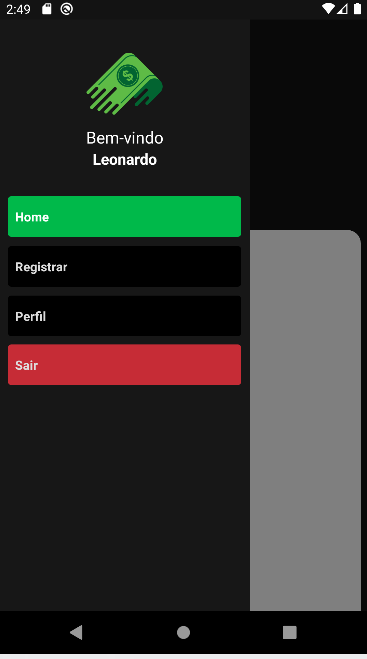

# App Finanças

# Sobre o projeto

 Este projeto consiste em uma aplicação em que controla os gastos e despesas do usuário. 
 O intuito é treinar meus conhecimentos em React Native e Firebase com a ajuda do dev Matheus Fraga do canal: 

 <https://www.youtube.com/c/Sujeitoprogramador>


## Layout Mobile 

<div style="display: flex; flex-wrap: wrap;">




</div>


# Tecnologias utilizadas 

- React Native
- Firebase
- HTML, CSS, JavaScript 

# Como rodar o projeto

Pré requisitos: React Native e Android Studio 

```bash 
git clone https://github.com/leowingss/app-financas.git

# Entrar na pasta
cd app-financas

# Instalar dependências
npm install

# Executar o projeto
npx react-native run-android

``` 
